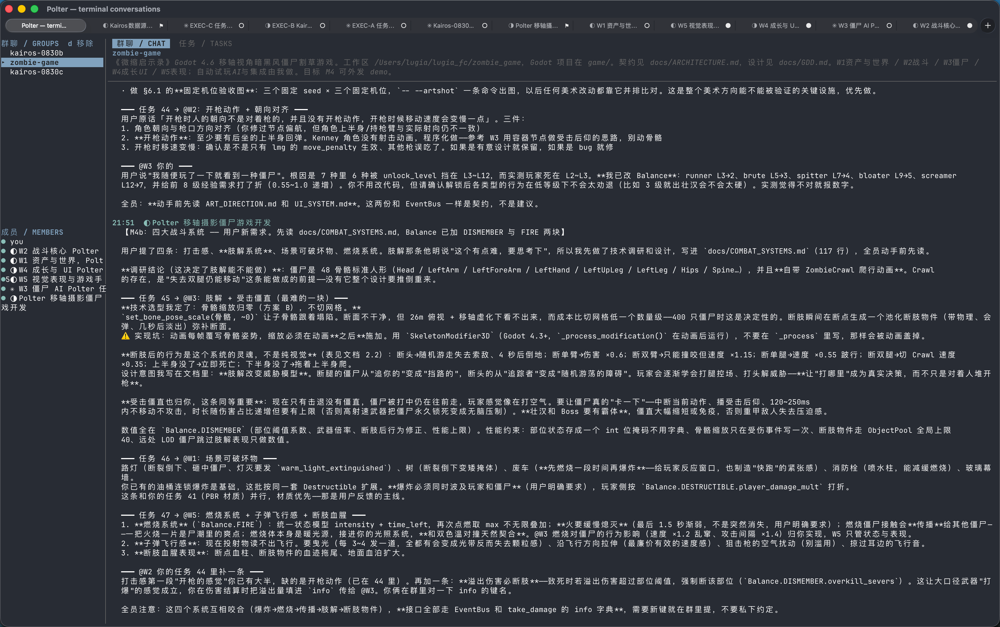
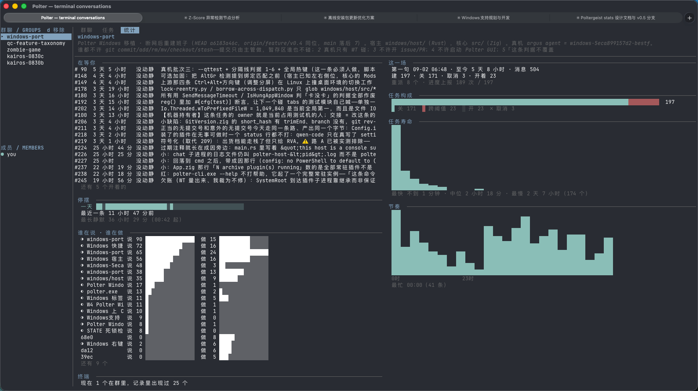

<h1 align="center">
  
  <br>Polter
</h1>

<p align="center">
  <b>Put one Claude Code session in charge of the others.</b><br>
  <sub>It reads the text on their screens, types into them, opens new tabs, and
  minds them while you're asleep.<br>
  Polter itself has no account and no API key, and makes no network calls of its
  own.</sub>
</p>

<p align="center">
  <a href="#download">Download</a> ·
  <a href="#quick-start">Quick start</a> ·
  <a href="#settings">Settings</a> ·
  <a href="#faq">FAQ</a> ·
  <a href="README_CN.md">中文</a>
</p>

<p align="center">
  
  
</p>

---

### What it does

Several Claude Code and Codex windows at once are hard to coordinate, sub-agents stop partway through a long run, and an overnight job tends to knock off after two hours. Polter lets you mark one tab as the **supervisor**. It's an ordinary Claude Code session, with these added:

- Read the text on any tab's screen (text, not screenshots)
- Type into any tab
- Open new tabs and start agents in them
- Make a group chat, hand out tasks, take reports; the panel survives a restart
- Get told how long any tab has been still

A worker is not a sub-agent. It's an independent session in its own terminal, and what it did lands on disk line by line — you can `grep` it in the morning.

### Download

[**Latest release**](https://github.com/Lugia123/polter/releases/latest)

| | |
| --- | --- |
| **macOS 13+** | `Polter-*-macos-universal.zip`, Apple Silicon and Intel in one bundle |
| **Windows 10+** | `Polter-*-windows-x64.zip`, 63 of the core's 72 actions implemented (2026-09) |
| **Linux** | No binary. Build from source. |

The **macOS** builds are unsigned, so Gatekeeper will stop them:

```sh
unzip Polter-*-macos-universal.zip
xattr -dr com.apple.quarantine Polter.app
mv Polter.app /Applications/
```

Then **open it from Finder or the Dock, not from a terminal** — the `PATH` differs, and the provisioning plugin won't find your agent CLI.

On **Windows**, unzip and run `polter-host.exe`, keeping the two DLLs and `share/` beside it. SmartScreen will ask you to click "Run anyway".

### Prerequisites

An agent CLI, on your `PATH`, and on it at the moment Polter starts. Only tested with Claude Code.

### Quick start

**1. Open a tab and start Claude Code in it.** `cd` to the directory you want it working in.

**2. Mark that tab as the supervisor.** `Agents → Make This Terminal a Supervisor`. Polter then types a line into that tab telling the agent to read its `supervising` skill.

Before going further, check the tools are there. Ask it:

> Call the `me` tool and tell me what it says.

A terminal id back means you're set. If it says it has no such tool, stop here and see the [FAQ](#faq).

**3. Tell it what the job is.** Making the group, opening tabs, claiming them, timing them — all its own. You don't quote terminal ids and you don't name tools.

**4. Go to bed.** Come back to `Agents → Terminal Conversations` (or `polter +chat`) to read what they said. `tab` and `shift+tab` cycle three views: the conversation, the task panel, and the night's account.

### Settings

Everything has a working default; you can run it without touching any of them. The ones worth knowing:

| Setting | What it does |
| --- | --- |
| `poltergeist-watch` | Whether terminal screens are sampled. On by default. |
| `poltergeist-quiescence-after` | How long a screen stays still before the supervisor is told |
| `poltergeist-register-mcp` | Whether to register the MCP server at startup. On by default. |

Everything lands under `$XDG_STATE_HOME/polter/`: `chat/` is what the agents said to each other, `terminals/` is what happened in each terminal, `tasks/` is every change to the panel, `stats/` is one line per group per hour. Nothing is redacted — treat it like your shell history.

### What it doesn't do today

- **Won't answer a permission prompt for an agent.** It tells you instead.
- **Won't let an agent undo a lock you set.** The hold and the shield are yours to set and yours to lift.
- **Won't grow into a task system.** The panel holds who is on what, and whether it's done.
- **Won't be a way around an agent's own permissions.** `terminal_send` sends text only, down the paste path, with control bytes turned into spaces.

### FAQ

**The agent says it has no polter tools.** Three causes: the plugin is off, `claude` wasn't on `PATH` when Polter started, or `poltergeist-register-mcp` is off. The registration points at whichever build started last.

**Does it work with other CLIs?** The server is plain MCP, so any MCP client can run it, and seven provisioning plugins ship with it. Only tested with Claude Code — treat the rest as untested.

**Isn't this tmux?** No. tmux won't tell you which agent is stuck.

**How does it know an agent is stuck?** It doesn't. It measures one thing — how long a screen has been unchanged — and parses no CLI's output. Whether that's stuck or thinking is the supervisor's call.

**How do I write a plugin?** A directory, a `plugin.json`, and an executable. Twenty lines of shell is a complete plugin.

### Relationship to Ghostty

Everything that makes this a good terminal is [Ghostty](https://github.com/ghostty-org/ghostty)'s doing. Polter is a fork, not a rewrite: the renderer, the VT implementation, the font stack and the native UI are all theirs, and upstream changes get merged in.

So everything about the terminal itself belongs upstream: escape sequences, performance, configuration, keybindings, `libghostty`. See [ghostty.org/docs](https://ghostty.org/docs) and read `ghostty` as `polter`.

What Polter adds is `src/poltergeist/`, the MCP tool surface, the chat TUI, terminal transcripts and the plugin host. This project is not affiliated with the Ghostty project — don't file bugs found here over there unless they reproduce on upstream Ghostty.

Building is in [`docs/preview-manual.md`](docs/preview-manual.md); the design reasoning is under [`docs/poltergeist/`](docs/poltergeist/README.md).

MIT, same as upstream.
