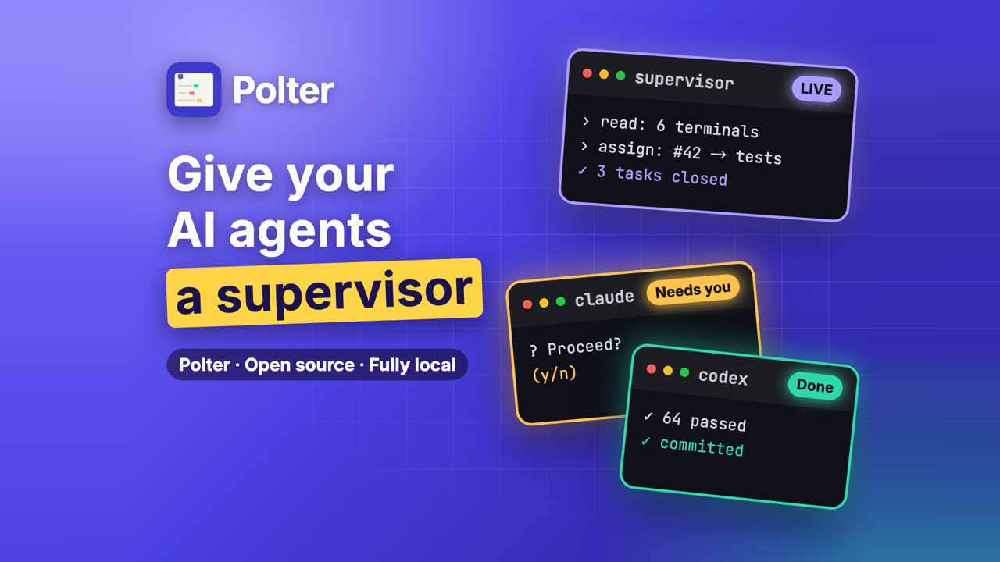

<h1 align="center">
  
  <br>Polter
</h1>

<p align="center">
  <b>A terminal multiplexer and orchestrator for AI agents.</b><br>
  <sub>Put one Claude Code session in charge of the others. Polter is a terminal that lets you run multiple coding agents in parallel. One agent acts as the Supervisor: via MCP, it reads the screens of other tabs, types into them, opens new tabs, and manages them while you step away.</sub>
</p>

<p align="center">
  <a href="#download--install">Download</a> ·
  <a href="#quick-start">Quick Start</a> ·
  <a href="#key-features">Features</a> ·
  <a href="#built-in-ai-screenshots--annotations">AI Screenshots</a> ·
  <a href="#compared-to-alternatives">Comparisons</a> ·
  <a href="#faq">FAQ</a> ·
  <a href="#contact">Contact</a> ·
  <a href="README_CN.md">中文版</a>
</p>

<p align="center">
  <a href="https://lugia123.github.io/polter/?lang=en"></a><br>
  <sub><a href="https://lugia123.github.io/polter/?lang=en">▶ Watch the 80-second demo video</a></sub>
</p>

<p align="center">
  
  
</p>

---

### Why Polter? (The Problem & Solution)

Running multiple Claude Code or Codex windows at the same time is hard to manage. Sub-agents often stop working halfway through a long task, or an overnight job gets stuck after a few hours waiting for input. 

**The Solution:** Polter is a Ghostty-based terminal with a built-in MCP (Model Context Protocol) server. You set one terminal tab as the **Supervisor**. This supervisor is a normal Claude Code session that is given special tools to manage all other tabs (Workers). 

Workers are not sub-agents; they are independent terminal sessions, and their output lands on disk line by line (you can `grep` it in the morning). 

The supervisor is not polling. Polter actively pushes a notice when a screen has stopped moving, so what a quiet night costs in tokens follows how often a worker stalled, not how long the job ran.

### Key Features

*   **Smart Supervisor:** The supervisor agent can read the text on any tab (real text, not screenshots), type commands into any tab, and open new tabs to start new agents.
*   **Team Management:** It can create a group chat, assign tasks, and receive reports. This task panel survives a terminal restart.
*   **Idle Detection:** Polter tracks how long each screen has been inactive and tells the supervisor if a worker is stuck.
*   **Roles & Projects:** Save your favorite agent settings (skills, prompts, models) as Roles. Save your workspace (tabs, directories, history) as Projects and load them later (macOS and Windows only).
*   **Hooks:** A Claude Code started from a Role tells Polter when its turn ends and what it said. The supervisor is notified directly, rather than waiting to read a still screen. (Claude Code only; other CLIs are monitored by screen activity).
*   **Plugins:** Polter ships with 7 provisioning plugins out of the box.
*   **Safe Permissions:** The supervisor can only answer permission prompts in tabs it opened itself. You can manually allow it in specific tabs via `Agents → Let a Supervisor Answer Prompts Here`.
*   **One Settings Window:** Roles, projects, plugins, and configs are managed in one place (`Settings…`).
*   **Multilingual:** UI supports English and Chinese (follows your system setting or the `Language` menu).

### Built-in AI Screenshots & Annotations

Polter comes with a built-in screenshot tool specifically designed for AI workflows. 
Unlike normal screenshot tools, **the text you write and the boxes you draw are saved as readable data.** A `.json` file is created next to every screenshot. When you paste the image to the AI, your annotations are sent alongside it as pure text, meaning the AI doesn't need to guess or use OCR to read your handwriting.

*   **Trigger Anywhere:** Press `⌘⇧0` (Mac) or `Ctrl+Shift+0` (Windows). Works globally. *(Note: On Windows, if you have multiple Chinese input methods, this shortcut might be occupied by the system's "switch input language" hotkey).*
*   **Mouse Trigger:** Hold `⌘⇧` (Mac) or `Ctrl+Shift` (Windows) and click your mouse. *(Note: This is a system-wide hook. On Windows, Polter swallows the click. On macOS, the click passes through to the app below, which might open links. You can change this behavior or disable it via the `screenshot-mouse-trigger` setting).*
*   **Smart Select & Scrolling Pages:** Auto-selects windows or free-drags. Click "Long Screenshot" to automatically scroll and stitch a long webpage or code file.
*   **Rich Editable Annotations:** Add text, arrows, numbers, or boxes. Includes an irreversible mosaic blur (the unblurred original is only in memory, never written to disk or clipboard).
*   **Agent-Controlled Captures:** Your Supervisor agent can use MCP tools to list windows, take screenshots, capture long pages, or draw annotations. *(If you want strict privacy, you can disable this via the `screenshot-agent-access` setting; it is allowed by default).*
*   **Permissions Required:** **macOS requires both "Screen Recording" and "Accessibility" permissions.** (Accessibility is needed for auto-scrolling and the agent's `screenshot_long` tool. Without it, scrolling falls back to manual, and agent long captures will fail). Windows requires no permissions.
*   **Auto-Cleanup:** Every time Polter starts, screenshots older than 7 days that match the naming convention (including pasted clipboard images) are automatically deleted from the screenshot folder.

### Download & Install

[**Download the latest release here**](https://github.com/Lugia123/polter/releases/latest)

| OS | File | Note |
| --- | --- | --- |
| **macOS 13+** | `Polter-*-macos-universal.zip` | Apple Silicon and Intel supported. |
| **Windows 10+** | `Polter-*-windows-x64.zip` | x64. Unzip and run, no installer and no permissions needed. |
| **Linux** | No pre-built binary. | You must build from source. (Screenshot feature not yet available). |

**For macOS users:**
The builds are currently unsigned, so Apple's Gatekeeper will block it. Run this in your terminal to allow it:
```sh
unzip Polter-*-macos-universal.zip
xattr -dr com.apple.quarantine Polter.app
mv Polter.app /Applications/
```
*Important: Open Polter from your Finder or Dock, not from the terminal, so it can correctly find your agent tools on your `PATH`.*

**For Windows users:**
Unzip the folder and run `polter-host.exe`. Keep all other files (like DLLs and `share/`) in the same folder. If Windows SmartScreen warns you, click "Run anyway".

### Prerequisites
An agent CLI, on your `PATH`, and on it **at the moment Polter starts**. Only tested deeply with Claude Code.

### Quick Start

1. **Start Claude Code:** Open a tab in Polter, `cd` to your project folder, and start Claude Code.
2. **Set the Supervisor:** Go to the menu: `Agents → Make This Terminal a Supervisor`.
3. **Test the Connection:** Ask the agent: *"Call the `me` tool and tell me what it says."* If it replies with a terminal ID, you are ready! *(If it says it has no such tool, stop here and check the [FAQ](#faq)).*
4. **Give the Command:** Tell the supervisor what you want to build. It will handle opening tabs and assigning tasks on its own. 
5. **Review Later:** Let it work. Later, go to `Agents → Terminal Conversations` (or run `polter +chat`) to see what they discussed. Press `tab` or `shift+tab` to cycle views: the conversation, the task panel, and the night's stats.

### Compared to Alternatives

*(Data read on 2026-10-04, based on each project's official docs)*

| Feature | Polter | tmux | Claude Code (Sub-agents) | [Claude Squad](https://github.com/smtg-ai/claude-squad) | [cmux](https://github.com/manaflow-ai/cmux) |
| --- | --- | --- | --- | --- | --- |
| **What is it?** | Terminal (Ghostty fork) with MCP server | Terminal multiplexer | Feature inside one Claude Code session | TUI using tmux and git worktrees | Ghostty-based macOS terminal |
| **Who watches agents?** | Another AI (Supervisor) | You | The parent AI session | You, in one window | You (via notifications) |
| **What is a worker?** | Independent session in a terminal tab | Whatever runs in a pane | A sub-agent of the parent session | Independent session in a git worktree | Whatever runs in a pane |
| **If it stops moving?** | Supervisor is told how long it’s been idle | Bell rings (if configured) | — | — | Notification rings |
| **File Isolation?** | None (They share your checkout) | None | Parent directory (or worktree if asked) | Separate git worktree and branch each | None |
| **Platforms** | macOS, Windows | Unix-like systems | Wherever Claude Code runs | Requires tmux and `gh` | macOS |

**What Polter does not have:** It gives workers no worktree of their own, and it has no browser pane (which cmux has). If isolation per task is what you need, Claude Squad's model is the one built for it.

### Privacy & Settings

All data stays on your computer. Nothing is redacted or sent to the cloud by Polter. Think of it like your normal shell history. Files land in `$XDG_STATE_HOME/polter/`:
*   `chat/`: What the agents said to each other.
*   `terminals/`: Transcripts of what happened in each terminal.
*   `tasks/`: Every change to the task panel.
*   `stats/`: One line per group per hour.

You can change settings in the `Settings…` menu. Some useful ones:
*   `poltergeist-watch`: Allows screen sampling (Off by default; supervisor turns it on with `set_watch`).
*   `poltergeist-quiescence-after`: A duration (e.g., 3 minutes by default) for how long a screen stays still before notifying the supervisor.
*   `poltergeist-register-mcp`: Whether to register the MCP server at startup (On by default).
*   `screenshot-directory`: Where screenshots are saved. Extremely useful to point into your project directory if your agent cannot read files outside its workspace.
*   `screenshot-agent-access`: Whether agents are allowed to use screenshot MCP tools.
*   `clipboard-paste-image`: Whether pasting an image into the terminal turns it into a file path for the CLI to read.

### Guardrails (What Polter WON'T do)

*   **Won't bypass your permissions.** `terminal_send` sends text only, down the paste path, with control bytes turned into spaces. It cannot force an agent to bypass its own permissions.
*   **Won't answer unexpected prompts.** It only answers permission prompts in tabs the supervisor opened itself (unless you authorize otherwise).
*   **Won't undo your locks.** The terminal UI hold and shield are yours to set and yours to lift. An agent cannot unlock them.
*   **Won't grow into a task system.** The panel merely holds who is on what, and whether it's done.

### FAQ

**1. The agent says it has no "polter tools". What's wrong?**
Three causes: the plugin is off, `claude` wasn't on your `PATH` when Polter started, or `poltergeist-register-mcp` is off. The registration points at whichever build started last.

**2. Does it work with other AI tools besides Claude Code?**
The server uses standard MCP, so any MCP client can run it, and 7 provisioning plugins ship with it. However, we have only tested it deeply with Claude Code. Treat the rest as untested.

**3. Isn't this just tmux?**
No. `tmux` arranges panes and leaves the watching to you. Polter tells one agent how long each of the others has been still and lets it read their screens and type into them.

**4. Claude Code already has sub-agents. Do I need this?**
Not if all you want is to split one job up inside one session. A sub-agent belongs to its parent session. A Polter worker is an independent session in its own terminal, and the supervisor can read its screen and is told how long it has been still.

**5. How does it know an agent is stuck?**
It doesn't. It measures one thing—how long a screen has been unchanged—and parses no CLI's output. Whether that means it's stuck or just thinking is the supervisor's call.

**6. Is this related to Poltergeist?**
No. `steipete/poltergeist` is a file watcher and build tool, and its wrapper command is also called `polter`. The two projects share a ghost theme and nothing else; `poltergeist-*` here is only the prefix of this project's settings.

**7. How do I write a plugin?**
A directory, a `plugin.json`, and an executable. Twenty lines of shell is a complete plugin.

### Contact

*   **Email:** [xugf@bestfunc.com](mailto:xugf@bestfunc.com)
*   **Bugs and feature requests:** [GitHub Issues](https://github.com/Lugia123/polter/issues)

### Relationship to Ghostty

Everything that makes this a good terminal is [Ghostty](https://github.com/ghostty-org/ghostty)'s doing. Polter is a fork, not a rewrite: the renderer, the VT implementation, the font stack, and the native UI are all theirs, and upstream changes get merged in.

So everything about the terminal itself belongs upstream: escape sequences, performance, configuration, keybindings, `libghostty`. See [ghostty.org/docs](https://ghostty.org/docs) and read `ghostty` as `polter`.

What Polter adds is `src/poltergeist/`, the MCP tool surface, the chat TUI, terminal transcripts, and the plugin host. This project is not affiliated with the Ghostty project — don't file bugs found here over there unless they reproduce on upstream Ghostty.

Building instructions are in [`dev-docs/preview-manual.md`](dev-docs/preview-manual.md); design reasoning is under [`dev-docs/poltergeist/`](dev-docs/poltergeist/README.md).

License: MIT, same as upstream.

---
*Thanks to the [LINUX DO](https://linux.do) community, where Polter was first shared.*
