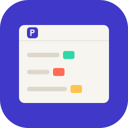
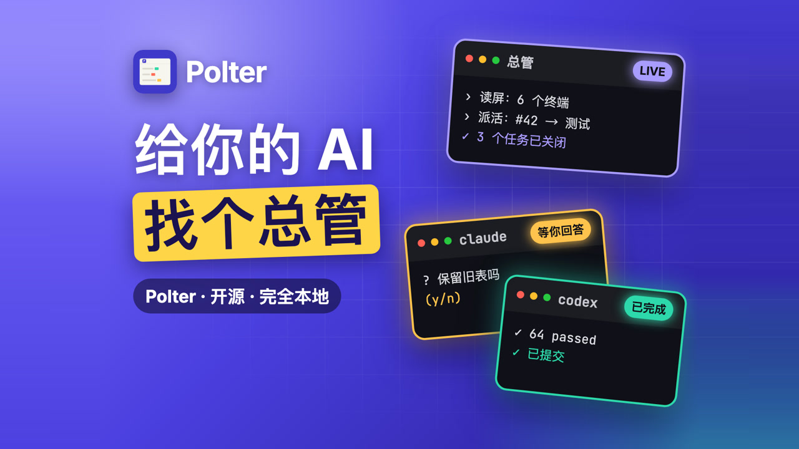
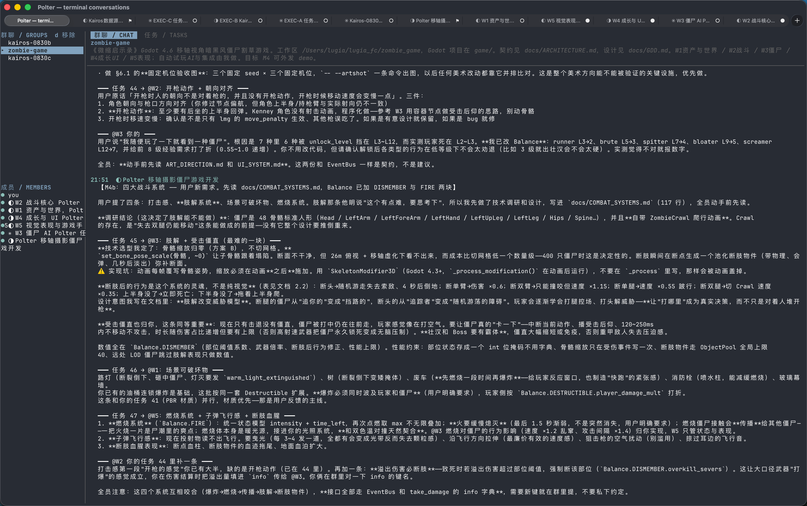
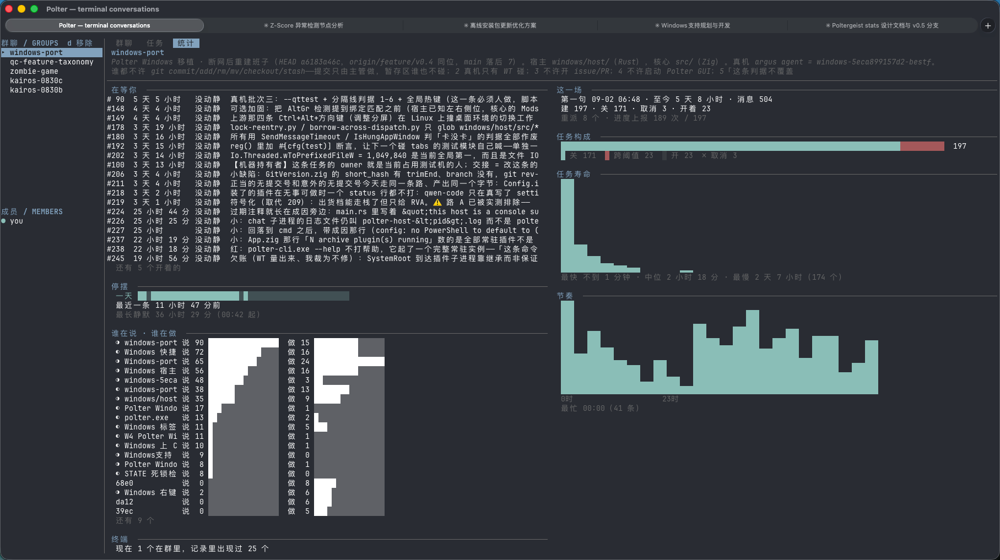

<h1 align="center">
  
  <br>Polter
</h1>

<p align="center">
  <b>专为 AI 智能体打造的终端复用器与大管家。</b><br>
  <sub>让一个 Claude Code 会话成为其他 AI 的“包工头”。Polter 是一个允许你同时运行多个 AI 编程智能体的终端。你可以指定其中一个作为“总管”：通过 MCP 协议，它能读取其他标签页的屏幕文字、替它们敲键盘、新建标签页，并在你离开时帮你盯着它们。</sub>
</p>

<p align="center">
  <a href="#下载安装">下载安装</a> ·
  <a href="#快速上手">快速上手</a> ·
  <a href="#核心功能">核心功能</a> ·
  <a href="#专为-ai-设计的截图工具">AI 专属截图</a> ·
  <a href="#竞品对比">竞品对比</a> ·
  <a href="#常见问题-faq">FAQ</a> ·
  <a href="README.md">English</a>
</p>

<p align="center">
  <a href="https://lugia123.github.io/polter/?lang=zh"></a><br>
  <sub><a href="https://lugia123.github.io/polter/?lang=zh">▶ 观看 73 秒演示视频</a></sub>
</p>

<p align="center">
  
  
</p>

---

### 痛点与解决方案

在本地同时开好几个 Claude Code 或 Codex 窗口非常难以管理。这些 AI“打工人”经常在长任务中途停摆，如果让它们通宵干活，往往两三个小时后就卡在某个需要确认的提示前发呆。

**解决方案：** Polter 是一个基于 Ghostty 终端改造的项目，内置了 MCP (模型上下文协议) 服务器。你可以将其中一个终端标签页设为**“总管 (Supervisor)”**。它其实就是一个普通的 Claude Code，但 Polter 给了它特殊的工具来管理其他标签页。

其他工作节点并不是子智能体，而是完全独立的终端会话，它们的输出会逐行保存在硬盘上（第二天早上你可以用 `grep` 去搜索查阅）。

总管并不是在不停地轮询。当某个屏幕不再发生变化时，Polter 会主动推送通知。因此，一个安静的夜晚会消耗多少 Token，取决于节点卡住了多少次，而不是任务运行了多久。

### 核心功能

*   **聪明的总管：** 总管可以读取任何标签页屏幕上的纯文本（是真正的文字，不是截图识别），能在任意标签页里输入指令，还能新建标签页启动新的打工人。
*   **团队管理：** 它可以拉一个群聊、分发任务、接收工作汇报。这个任务面板就算你重启终端也依然在。
*   **发呆检测：** Polter 会计算每个屏幕有多久没动静了，一旦卡死，立刻通报给总管。
*   **角色与项目：** 把常用的 AI 启动参数（技能、提示词、模型）保存为“角色 (Role)”。通过“项目”功能可以保存当前所有的标签页、目录和历史记录，下次一键恢复（支持 macOS 和 Windows）。
*   **消息钩子 (Hooks)：** 由角色启动的 Claude Code 会在一轮对话结束时，主动告诉 Polter 它说了什么。总管会直接收到通知，而不是被动等待静止的屏幕。（目前仅限 Claude Code；其它工具依然通过监听屏幕活动来监控）。
*   **内置插件：** 发行版开箱即带 7 个配置插件。
*   **安全权限：** 总管只能在它自己创建的标签页里自动回答权限请求，你也可以手动对特定标签页放权（`Agent → 允许总管在此回答提示`）。
*   **统一设置：** 角色、项目、插件和配置文件全部在一个设置窗口中集中管理。
*   **中英双语：** 菜单和窗口会自动跟随系统语言，也可以在 `Language` 中手动切换。

### 专为 AI 设计的截图工具

Polter 内置的截图工具最大的特点是：**标注是可读的数据**。每张图旁边都有一个 `.json` 文件，记录了你写的字、框的位置和编号。粘给 AI 时，标注文字随图片一起以纯文本送达，AI 不需要再从图里“肉眼认字”。

*   **全局触发：** 快捷键（Mac `⌘⇧0`，Windows `Ctrl+Shift+0`）。*(注意：在 Windows 上，该热键极易与系统的“切换输入语言”快捷键冲突，特别是安装了多个中文输入法时)。*
*   **鼠标触发：** 按住 `⌘⇧` (Mac) 或 `Ctrl+Shift` (Windows) 单击鼠标。*(注意：这是系统级拦截。在 Windows 上该点击会被 Polter 吞掉；但在 Mac 上点击会穿透到底层应用，比如在浏览器里可能会误点开链接。你可以在设置里通过 `screenshot-mouse-trigger` 修改或设为 `none`)。*
*   **智能选区与长截图：** 自动吸附窗口或自由框选。点击“长截图”，程序会自动向下滚动拼接长网页或代码。
*   **丰富的标注：** 矩形、箭头、文字、编号，以及不可还原的马赛克（原图只留在内存，绝不写进硬盘或剪贴板）。
*   **总管也能自行截图：** 总管可以通过 MCP 工具列出窗口、静默截图、截长图或自行画标注。*(如果你注重隐私，可以通过 `screenshot-agent-access` 设置关闭它，默认是允许的)。*
*   **权限要求：** **macOS 需要同时授予「屏幕录制」和「辅助功能」权限。**（辅助功能用于自动滚动和 agent 的 `screenshot_long` 工具；不授权的话，长截图会自动退化为手动滚动，且 agent 请求长截图会直接报错）。Windows 版不需要任何权限。
*   **自动清理：** 每次启动时，截图目录里超过 7 天且符合截图命名规则的文件（包含粘贴进来的剪贴板图片）会被自动清理。

### 下载安装

[**点击此处下载最新版本**](https://github.com/Lugia123/polter/releases/latest)

| 操作系统 | 文件包 | 备注 |
| --- | --- | --- |
| **macOS 13+** | `Polter-*-macos-universal.zip` | 原生支持 Apple 芯片和 Intel。 |
| **Windows 10+** | `Polter-*-windows-x64.zip` | 已实现 76 个核心操作中的 70 个（数据截至 2026-09-21）。 |
| **Linux** | 无现成安装包 | 需从源码编译。（截图功能此版本暂未实现）。 |

**macOS 用户必看：**
目前的安装包没有签名，会被苹果 Gatekeeper 拦截。请打开终端，输入以下命令解除隔离：
```sh
unzip Polter-*-macos-universal.zip
xattr -dr com.apple.quarantine Polter.app
mv Polter.app /Applications/
```
*重要提示：请从“访达 (Finder)”或“程序坞 (Dock)”中双击打开 Polter，不要通过终端命令启动，以确保它能正确读取你 `PATH` 中的 AI 工具环境变量。*

**Windows 用户必看：**
解压后直接运行 `polter-host.exe`，请把其他文件（DLL 和 share 文件夹）跟它放在同一个目录下。如果遇到 Windows SmartScreen 拦截，点击“详细信息 -> 仍要运行”即可。

### 前置条件
你需要有一个智能体 CLI（命令行工具）在你的系统 `PATH` 环境变量中，**且在 Polter 启动的那一刻就存在**。目前仅针对 Claude Code 进行了深度测试。

### 快速上手

1. **启动 Claude Code：** 打开一个 Polter 标签页，`cd` 到你的代码目录，启动 Claude Code。
2. **任命总管：** 点击菜单栏：`Agent → 设当前终端为总管`。
3. **测试连接：** 对它说：*“调用 `me` 工具，告诉我它说了什么。”* 如果它回复给你一串终端 ID，说明连接成功！*(如果它说没有这个工具，请停下来并查看 [FAQ](#常见问题-faq))*。
4. **下发任务：** 直接告诉总管你想做什么项目。接下来它会自己建群、开标签页、分配任务。
5. **查阅进度：** 把它挂在后台。之后你可以去 `Agent → 终端对话`（或运行 `polter +chat`）看它们的聊天记录。按 `tab` 或 `shift+tab` 可切换对话、任务看板和统计视图。

### 竞品对比

*(以下其他列的数据来源于对应项目官方文档，读于 2026-10-04)*

| 对比项 | Polter | tmux | Claude Code (子智能体) | [Claude Squad](https://github.com/smtg-ai/claude-squad) | [cmux](https://github.com/manaflow-ai/cmux) |
| --- | --- | --- | --- | --- | --- |
| **它是啥？** | 内置 MCP 的终端 (Ghostty fork) | 终端复用器 | Claude Code 会话内部功能 | 基于 tmux 和 git 工作区的 TUI | 基于 Ghostty 的 macOS 终端 |
| **谁来监督 AI？** | 另一个 AI (总管) | 你自己 | 父级会话 | 你，在同一个窗口里 | 你 (通过通知提示音) |
| **工作节点是啥？** | 终端里的独立会话 | 你在窗格里启动的任何东西 | 父会话的子智能体 | 自己工作区里的独立会话 | 你在窗格里启动的任何东西 |
| **画面不动时？** | 总管会被告知它发呆了多久 | 状态栏高亮并响铃 (需配置) | — | — | 响铃 (当 agent 发信号时) |
| **文件隔离？** | 无 (共享当前代码库) | 无 | 父目录 (或按要求新建工作区) | 每个智能体有独立的 git 工作区 | 无 |
| **支持平台** | macOS, Windows | 类 Unix 系统 | 能跑 Claude Code 的地方 | 需要 tmux 和 `gh` | macOS |

**Polter 没有的功能：** 它不会为工作节点提供独立的 worktree，也没有 cmux 那样的浏览器面板。如果你非常需要基于任务的文件隔离，Claude Squad 的架构是专门为你打造的。

### 隐私与设置

所有数据留在本地，Polter 不会自动发送任何信息到云端。你可以把它当成普通的 shell 历史记录对待。所有文件都在 `$XDG_STATE_HOME/polter/` 目录下：
*   `chat/`：智能体之间的对话。
*   `terminals/`：每个终端里的事件记录。
*   `tasks/`：任务面板的每一次变更。
*   `stats/`：每个群组每小时的统计。

几个值得了解的核心设置：
*   `poltergeist-watch`：是否允许屏幕采样。默认关闭；总管可针对单个终端打开。
*   `poltergeist-quiescence-after`：屏幕发呆多久后才会通知总管（这是一个时长配置，例如默认 3 分钟）。
*   `poltergeist-register-mcp`：是否在启动时注册 MCP 服务（默认开启）。
*   `screenshot-directory`：截图的保存目录。如果你的 agent 被限制只能读取工作区内的文件，可以把截图路径指向你的项目目录。
*   `screenshot-agent-access`：是否允许 agent 使用 MCP 截图工具。
*   `clipboard-paste-image`：粘贴图片时，是否将其转换为文件路径交由 CLI 读取。

### 安全护栏 (Polter 绝对不做的事)

*   **不会成为绕过权限的后门：** `terminal_send` 只通过粘贴通道发送纯文本，控制字节会被转成空格。它无法强迫 AI 去做被禁止的操作。
*   **不会乱答提示：** 除了总管自己开的窗口，它不会去别的窗口帮你胡乱回答权限确认。
*   **不会破解终端锁定：** 终端画面的锁定 (hold) 和防护 (shield) 只能由你设置和解除，AI 无法解锁。
*   **不会变成复杂的任务系统：** 任务面板仅仅记录谁在干什么，以及干完了没有。

### 常见问题 (FAQ)

**1. AI 说它没有 "polter 工具" 怎么办？**
三种可能：插件被禁用了；Polter 启动时 `claude` 命令不在 `PATH` 中；或者你在设置里把 `poltergeist-register-mcp` 关了。注册表指向的是最后一次启动的构建版本。

**2. 除了 Claude Code 还能用别的 AI 工具吗？**
服务端用的是标准 MCP 协议，任何 MCP 客户端都能接进来，自带了 7 个配置插件。但目前只针对 Claude Code 做了深度测试，其它工具请当作未测试对待。

**3. 这不就是 tmux 吗？**
不是。`tmux` 只是帮你分屏，盯着屏幕的活儿还得你干。Polter 的作用是把其它节点的发呆时间汇报给某一个智能体，并允许它读取别的屏幕和敲键盘。

**4. Claude Code 已经有子智能体了，我还需要这个吗？**
如果你只是想在一个会话内拆分任务，确实不需要。子智能体从属于父会话；但 Polter 的工作节点是完全独立的终端会话，总管可以跨终端管理它们。

**5. 它怎么知道 agent 卡住了？**
它并不知道。它只测量一件事——屏幕有多久没有发生变化——且不解析任何 CLI 的输出。到底是卡住了还是在思考，由总管自己来判断。

**6. 这个项目和 Poltergeist 有关系吗？**
没有。`steipete/poltergeist` 是一个文件监视器和构建工具，它的命令也叫 `polter`。这两个项目除了共用“幽灵”主题外毫无关联，这里的 `poltergeist-*` 仅仅是本项目的设置项前缀。

**7. 我该怎么写插件？**
一个目录、一个 `plugin.json`，外加一个可执行文件。20 行 shell 脚本就能写一个完整的插件。

### 和 Ghostty 终端的关系

让这一切成为一个优秀终端的功劳全部属于 [Ghostty](https://github.com/ghostty-org/ghostty)。Polter 是它的分叉 (Fork)，而不是重写：渲染器、VT 实现、字体栈以及原生 UI 全都是他们的，我们也会持续合入上游代码。

因此，有关终端本身的一切都归于上游：转义序列、性能、配置项、快捷键绑定以及 `libghostty`。请直接查阅 [ghostty.org/docs](https://ghostty.org/docs)（将里面的 `ghostty` 替换为 `polter` 即可）。

Polter 加进去的东西都在 `src/poltergeist/` 下，包含了 MCP 工具表面、聊天 TUI、终端转录日志和插件宿主。本项目不隶属于 Ghostty 官方——请不要把在这里发现的 bug 报给他们，除非你在原版 Ghostty 上也能复现。

构建指南在 [`dev-docs/preview-manual.md`](dev-docs/preview-manual.md) 中；设计思路记录在 [`dev-docs/poltergeist/`](dev-docs/poltergeist/README.md) 下。

采用 MIT 协议，和上游一致。

---
*感谢 [LINUX DO](https://linux.do) 社区，Polter 最早是在那里分享的。*
